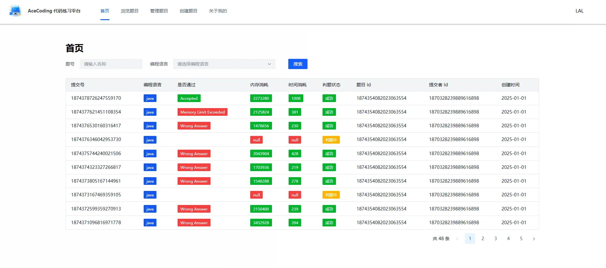
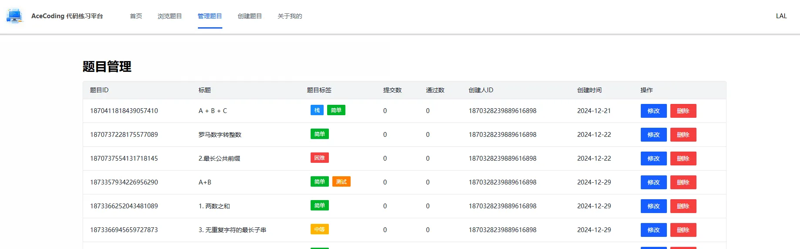
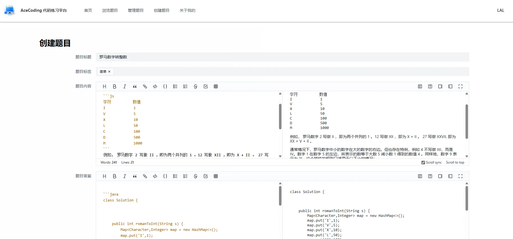
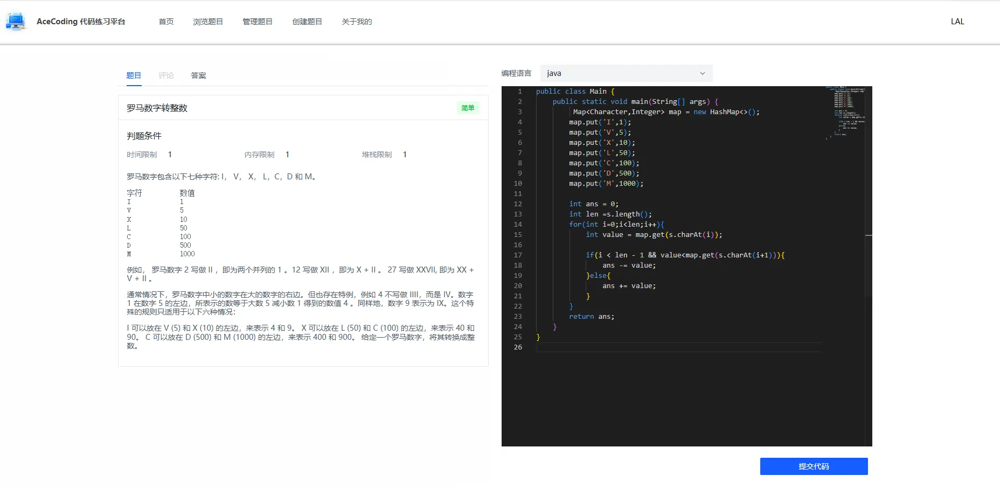
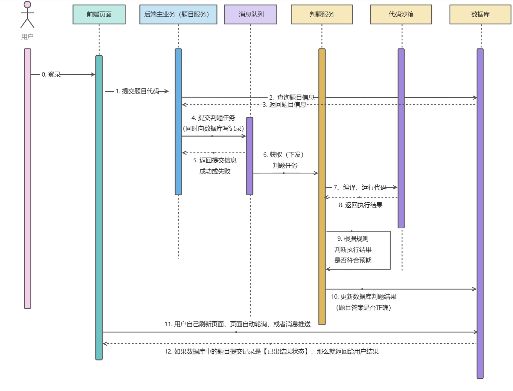

# AceCode 在线代码测评项目

## 项目介绍

AceCode 是一个功能强大的在线代码测评项目，旨在为开发者提供一个高效、便捷的代码练习和评估平台。它涵盖了从用户登录注册到题目管理、在线做题、代码编译执行以及判题服务等一系列完整的功能，能够满足不同层次开发者的需求，无论是初学者进行基础代码练习，还是专业开发者进行复杂算法的测试，AceCode 都能提供有力的支持。

## 项目演示

## 项目时序图

## 功能特性

- **用户登录注册**：支持用户创建账号并登录系统，保障用户数据的安全性和个性化体验。
- **用户管理**：管理员可以对用户信息进行管理，包括查看、编辑用户资料等，确保平台用户的有序性。
- **题目管理**：方便地对各类题目进行分类、编辑、删除等操作，实现题目资源的高效管理。
- **题目创建**：支持创建多种类型的编程题目，包括但不限于算法题、语法题等，满足不同场景的测评需求。
- **在线做题**：用户可以在网页上直接编写代码，无需本地环境配置，随时随地进行代码练习。
- **题目提交**：用户完成代码编写后，可一键提交，系统将自动进行后续的编译和判题流程。
- **在 Docker 代码沙箱中编译执行用户代码**：利用 Docker 技术创建安全的代码执行环境，隔离用户代码，确保系统的稳定性和安全性，同时支持多种编程语言的编译和执行。
- **判题服务**：根据预设的测试用例对用户提交的代码进行准确性和性能评估，快速给出详细的评判结果和反馈信息。

## 项目架构

本项目采用了前后端分离的架构设计，前端使用Vue 3 +Arco Design 组件库构建用户界面，提供流畅的交互体验；后端基于Java Spring Cloud + Spring Cloud Alibaba 微服务开发，负责处理业务逻辑、与数据库交互以及与 Docker 沙箱进行通信，实现代码的编译执行和判题功能。数据库选用MySQL存储用户信息、题目数据以及测评结果等数据，确保数据的持久化和高效读写。

特别鸣谢：==程序员鱼皮==

最好的编程圈子：https://www.codefather.cn/project
